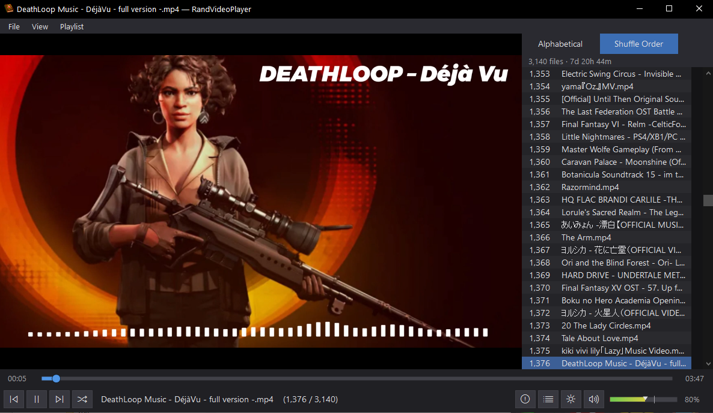

# RandVideoPlayer

I've been frustrated by audio playback randomization since the 90s, and this 
program solves those frustrations. I tend to have very large libraries of music
and/or music videos, and a traditional shuffle will play many of them more
with unnaturally high frequency. I want to hear all of my music, in a random
order, and then hear all of it again in a new random order. So that's what this
program does.

Particular extra shoutouts:
1. If you haven't played Deathloop yet, then you really should. It's super good!
2. If you're a programmer, and you're not using Squirrel Eiserloh's method of
   noise-for-random instead of something like Mersenne Twister, then again you
   really should!



---

## What it is

RandVideoPlayer is a lightweight Windows media player built around a very
specific workflow: point it at a folder full of audio and/or video files, and
it will play them in a stable, reproducible, shuffle-once-per-round order.
Every file in the folder is played exactly once per shuffle round; when the
round ends the list is reshuffled and the next round begins. Shuffle state is
persisted per-folder so you can close the app and come back later without
losing your place.

It wraps libVLC for playback (so codec coverage matches VLC's) but keeps the
UI deliberately minimal compared to VLC itself.

---

## Features

- **Folder-as-playlist.** Open any folder; every supported file inside
  (recursively) becomes a shuffled playlist.
- **Deterministic, persistent shuffle.** SquirrelNoise5-seeded Fisher–Yates.
  Shuffle order and current position are written to two hidden files in the
  folder (`.rvp_shuffle.json`, `.rvp_position.json`) so state survives
  restarts without risk of the frequent "current track" write corrupting the
  shuffle list.
- **Reshuffle on end-of-list** with anti-repeat (the first track of the new
  round will not be the track that just finished).
- **Manual reshuffle button** with confirmation.
- **Live folder reconciliation.** `FileSystemWatcher` handles files being
  added or removed while the app is running: removals drop from the list,
  additions are spliced into the shuffle list at a deterministic position
  after the currently-playing track.
- **Sidebar** with toggle between alphabetical view and shuffle-order view.
  Current track is highlighted. Double-click to jump. Right-click menu to
  Reveal in Explorer, Delete (Recycle Bin), or Open in Bandicut (if
  installed).
- **Header stats** show file count and aggregate total duration, computed in
  a background thread and cached in a hidden `.rvp_durations.json` per
  folder.
- **Resume the last-played file's playhead on app reopen.** The playhead is
  only remembered for the single file that was playing at shutdown — walking
  to a different track and back does not preserve a position within the
  original track.
- **Dark and light themes.** Dark by default. Themed title bar, scrollbars,
  menus, and controls.
- **Error panel** logs failed playback, scan errors, and file-system issues.
  A badge on the transport bar's error button flags unread entries.

---

## Getting started

The app targets **.NET 8** (framework-dependent). The native libVLC binaries
(`libvlc.dll` + `libvlccore.dll` + plugin tree) are pulled in via the
`VideoLAN.LibVLC.Windows` NuGet package and deployed alongside the EXE under
`libvlc/win-x64/`.

### Running from source

```bash
dotnet run --project RandVideoPlayer
```

### Building a release

```bash
dotnet publish RandVideoPlayer -c Release -r win-x64 --self-contained false
```

The output lands in `RandVideoPlayer/bin/Release/net8.0-windows/win-x64/publish/`.
The `libvlc/win-x64/` directory must travel with the EXE.

### First launch

On first launch you'll be prompted to pick a folder. Thereafter the last
opened folder is re-opened automatically. Use **File → Open Folder** or
**File → Recent Folders** to switch libraries.

---

## Controls

### Mouse

- **Left-click on the video panel** — toggle pause.
- **Mouse 4 / Mouse 5** (XBUTTON1 / XBUTTON2) — previous / next track in the
  shuffle order. Works when the cursor is over the app window.
- **Double-click in sidebar** — play that file.
- **Right-click in sidebar** — Play / Reveal in Explorer / Delete (Recycle
  Bin) / Open in Bandicut.
- **Scroll wheel over volume slider** — adjust volume.

### Keyboard

- **Space** — play / pause
- **← / →** — seek ±5 seconds
- **↑ / ↓** — volume ±5%
- **M** — mute / unmute
- **Enter (in sidebar)** — play selected file
- **F9** — toggle sidebar
- **Ctrl+O** — open folder

### Transport bar

- Prev · Play/Pause · Next · Reshuffle
- Scrubber with elapsed / total time
- Mute · Volume slider (0–150%, gradient fill)
- Sidebar toggle · Theme toggle (dark/light) · Error panel toggle

---

## Supported file types

**Video.** mp4, mkv, avi, mov, wmv, flv, webm, m4v, mpg, mpeg, ts, m2ts, vob,
ogv, 3gp, 3g2

**Audio.** mp3, ogg, oga, opus, flac, wav, m4a, aac, wma, aif, aiff, ape, mka

Codec support matches whatever the bundled libVLC build supports (i.e., very
close to VLC Media Player).

---

## Where state lives

### Per-folder (written into the folder itself, all hidden)

- `.rvp_shuffle.json` — current shuffle order and seed.
- `.rvp_position.json` — current index and (at shutdown only) playhead
  position in ms.
- `.rvp_durations.json` — cached per-file durations, keyed by file size and
  mtime so cached entries stay valid unless the file changes.

### Application-wide

Stored in `%AppData%\ArcenSettings\RandVideoPlayer\`:

- `settings.json` — `lastFolder`, `recent` folder list, `darkMode`.
- `settings-user.json` — volume, sidebar visibility / mode, window bounds,
  error-panel visibility. (Mute is deliberately **not** persisted — it's
  reset to off at every launch so a forgotten mute never silently breaks
  audio on a subsequent launch.)

---

## Third-party integrations

- **Bandicut** — if Bandicut is installed (auto-detected from common install
  paths and the registry), the sidebar's right-click menu gets an "Open in
  Bandicut" entry that hands the file to Bandicut for editing. The entry is
  greyed when Bandicut is absent.

---

## Architecture notes

- `Library/` — folder scan, shuffle engine, noise RNG, playlist state,
  duration index.
- `Playback/PlaybackController.cs` — single-player libVLC wrapper. Captures
  the UI `SynchronizationContext` at construction and marshals all libVLC
  event callbacks back onto the UI thread before touching `MediaPlayer`
  state; this avoids deadlocks that can occur when rapid track changes
  interleave with libVLC's internal event thread.
- `Controls/` — custom-drawn transport bar, scrubber, volume slider,
  sidebar, error panel, icon buttons.
- `UI/` — theme palettes, dark-mode chrome helpers (DWM title bar +
  UxTheme scrollbars), low-level mouse hook.
- `Integrations/` — shell-level helpers (Recycle Bin send, Explorer reveal)
  and Bandicut detection/launch.
- `AppState/AppSettings.cs` — two-file settings persistence with migration
  from older unified format.

---

## License

The application source code is MIT-licensed; see [`LICENSE.md`](LICENSE.md).
LibVLC and LibVLCSharp are LGPL-2.1-or-later; their license notices and
redistribution conditions are detailed in the same file.
